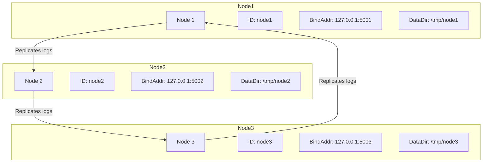

# Raft Cluster

This project demonstrates a Raft cluster with three nodes using the `github.com/hashicorp/raft` and `github.com/hashicorp/raft-boltdb/v2` packages in Go.

## Project Structure

```plaintext
raft-cluster/
├── config/
│   └── config.yaml
├── main.go
├── node/
│   ├── fsm.go
│   ├── node.go
│   └── snapshot.go
├── raftcluster/
│   ├── config.go
│   └── node.go
└── go.mod
```

## Running the Nodes

Run each node with the appropriate configuration file:

```
go run main.go --config=config/config-node1.yaml
go run main.go --config=config/config-node2.yaml
```

## Raft Cluster Diagram


